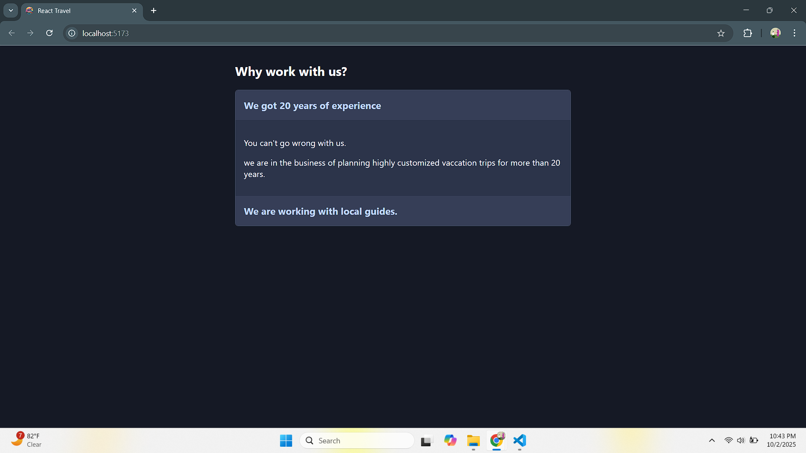
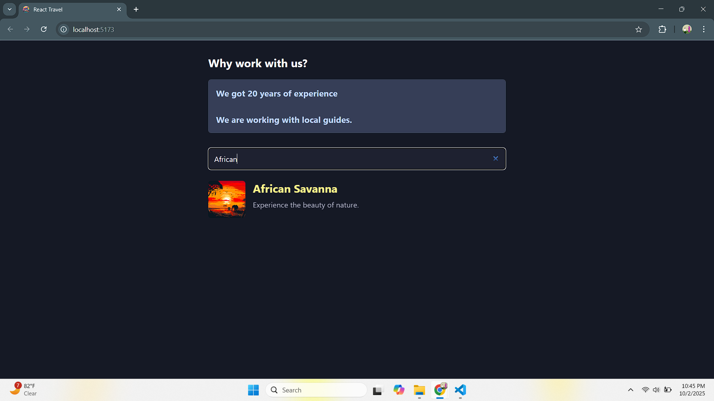

# React Patterns

This repository demonstrates advanced **React design patterns** including **Compound Components**, **Render Props**, and **Debouncing**, implemented in a simple Vite + React setup.

It’s meant as a **learning resource** and a **reference project** for developers who want to understand and apply these patterns in real-world applications.

---

## 🚀 Features

- **Compound Components** – Build flexible APIs where the parent manages state and child components consume it.  
- **Render Props** – Share reusable stateful logic while leaving rendering control to the user.  
- **Debouncing** – Optimize performance by reducing unnecessary re-renders or API calls while typing.

---

## 📸 Demo / Screenshots

### Compound Components (Toggle Example)


---

### Render Props (DataFetcher Example)


---

### Debouncing (Search Input Example)


---

## 📂 Project Structure

```

react-patterns/
├── src/
│   ├── components/
│   │   ├── Compound/        # Compound Components pattern
│   │   ├── RenderProps/     # Render Props pattern
│   │   └── Debounce/        # Debouncing pattern
│   ├── hooks/               # Custom hooks like useDebounce
│   ├── App.jsx              # Main entry component
│   └── main.jsx             # ReactDOM entry
├── public/
├── docs/                    # Screenshots and GIFs for README
├── package.json
├── vite.config.js
└── README.md

````

---

## ⚡ Getting Started

### Prerequisites
- Node.js (>= 20)
- npm or yarn

### Installation

```bash
git clone https://github.com/AqibNiazi/react-patterns.git
cd react-patterns
npm install
````

### Run Development Server

```bash
npm run dev
```

### Build for Production

```bash
npm run build
```

---

## 🤝 Contributing

Contributions are welcome!
You can add new patterns (like **Higher-Order Components**, **State Reducers**, **Portals**, etc.), improve documentation, or suggest better examples.

Steps:

1. Fork the repo
2. Create a branch: `git checkout -b feature/my-pattern`
3. Commit your changes
4. Push to the branch: `git push origin feature/my-pattern`
5. Open a pull request

---

## 📜 License

MIT License © 2025 [Aqib Niazi](https://github.com/AqibNiazi)

---

## ⭐ Support

If you found this helpful, consider giving the repository a ⭐ on GitHub!

```

